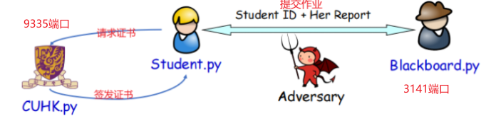
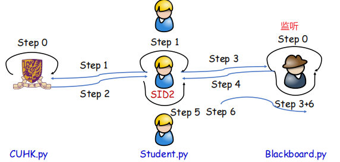
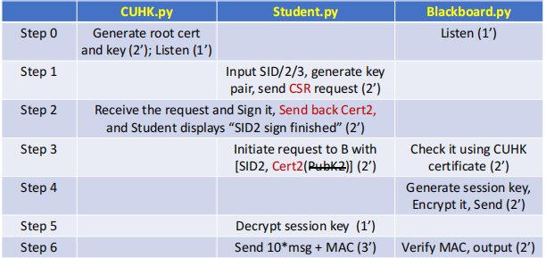
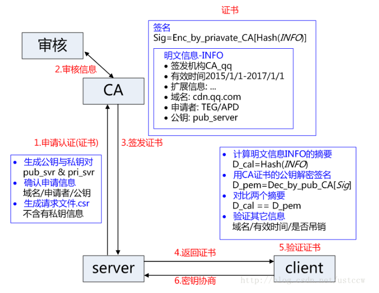

### 场景：学生向Blackboard上提交作业

#### 具体流程

##### CUHK(服务端) Port:9335
> 保持进程监听Student的请求

##### Student（客户端）
> 当输入Student ID后，向CUHK(9335)发起请求。

##### Blackboard（服务端） Port:3141
> 保持进程监听

##### Socket

##### CA Work Process

1. **申请认证**：服务器需自己生成公钥私钥对pub_svr & pri_svr，同时根据 pri_svr 生成请求文件 csr, 提交给CA，csr中含有公钥、组织信息、个人信息(域名)等信息。(图一中server.req就是csr请求文件)
2. **审核信息**：CA通过线上、线下等多种手段验证申请者提供信息的真实性，如组织是否存在、企业是否合法，是否拥有域名的所有权等。
3. **签发证书**：如信息审核通过，CA会向申请者签发认证文件-证书。
证书包含以下信息：申请者公钥、申请者的组织信息和个人信息、签发机构CA的信息、有效时间、证书序列号等信息的明文，同时包含一个签名。
签名的产生算法：首先，使用散列函数计算公开的明文信息的信息摘要，然后，采用 CA的私钥对信息摘要进行加密，密文即签名。（图一中生成server.crt）
4. **返回证书**：client如果请求验证服务器，服务器需返回证书文件。（图一中handshake传回server.crt）
5. **client验证证书**：client读取证书中的相关的明文信息，采用相同的散列函数计算得到信息摘要，然后，利用对应 CA的公钥解密签名数据，对比证书的信息摘要，如果一致，则可以确认证书的合法性，即公钥合法。客户端然后验证证书相关的域名信息、有效时间是否吊销等信息。
客户端会内置信任CA的证书信息(包含公钥)，如果CA不被信任，则找不到对应 CA的证书，证书也会被判定非法。(图一中check可选，我们可以选择不验证服务器证书的有效性)
6. **秘钥协商**：验证通过后，Server和Client将进行秘钥协商。接下来Server和Client会采用对称秘钥加密。(对称加密时间性能优)（图一中 pre-master/change_cipher_spec/encrypted_handshake_message过程）
7. **数据传输**：Server和Client采用对称秘钥加密解密数据。[5]

##### Note
> 一般流程为: 先生成一个私钥，然后用私钥生成证书请求(证书请求里应含有公钥信息)，再利用证书服务器的CA根证书来签发证书。但是向CA申请证书通常不免费，我们可以通过openssl自签名的形式生成ssl证书，实现https访问效果，.crt结尾的是证书文件，.key结尾的是密钥文件，.csr结尾的是证书请求文件。

##### Reference
- [1] Socket Programming 1: https://blog.csdn.net/a883774913/article/details/125395179
- [2] Socket Programming 2: https://blog.csdn.net/Dontla/article/details/103679153
- [3] OpenSSL Document: https://www.pyopenssl.org/en/latest/
- [4] Generate Self-Sign Certificate: https://blog.csdn.net/TheGreenSummer/article/details/110285923
- [5] SSL/TLS: https://blog.csdn.net/wuliganggang/article/details/78428866
- [6] SSL/TLS: https://blog.csdn.net/vip97yigang/article/details/84721027
- [7] Wraps pyOpenSSL for quick and easy PKI: https://github.com/LLNL/certipy
- [8] OpenSsl.crypto Usage: https://vimsky.com/zh-tw/examples/detail/python-method-OpenSSL.crypto.html