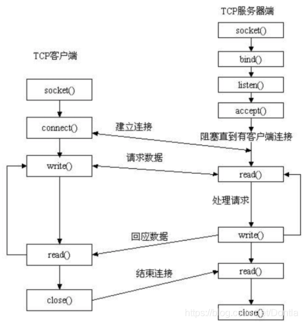

### 场景：学生向Blackboard上提交作业


#### 启动流程
1. 安装Openssl, pycrypto 库
```shell
pip3 install pyopenssl
pip3 install pycryptodome
```
1. 运行`CUHK.py`, `Blackboard.py`
2. 运行`Student.py`, 输入学生学号信息

#### 服务端与客户端
- **CUHK** ( 端口: 9335 )
- **Blackboard** ( 端口: 3141 )
- **Student**

#### 具体流程


1. 在启动 `CUHK.py` 和 `Blackboard.py` 后, 这两个进程会分别保持监听端口`9335`和`3141`
2. 同时，`CUHK.py`会生成钥匙对和根证书，将根证书与密钥分别存于本地`cuhk.cer`和`cuhk.key`位置。
3. 运行`Student.py`，然后输入**10**位**数字**作为学生ID。
4. `Student.py`将生成一个**密钥对**，并使用密钥对生成一个**CSR请求**。 
5. 序列化CSR请求并将其发送到`CUHK.py`（端口：9335）


#### 相关参考资料
###### Socket 流程


###### 基于证书的传输流程

> 1. **申请认证**：服务器需自己生成公钥私钥对pub_svr & pri_svr，同时根据 pri_svr 生成请求文件 csr, 提交给CA，csr中含有公钥、组织信息、个人信息(域名)等信息。
> 2. **审核信息**：CA通过线上、线下等多种手段验证申请者提供信息的真实性，如组织是否存在、企业是否合法，是否拥有域名的所有权等。
> 3. **签发证书**：如信息审核通过，CA会向申请者签发认证文件-证书。
证书包含以下信息：申请者公钥、申请者的组织信息和个人信息、签发机构CA的信息、有效时间、证书序列号等信息的明文，同时包含一个签名。
签名的产生算法：首先，使用散列函数计算公开的明文信息的信息摘要，然后，采用 CA的私钥对信息摘要进行加密，密文即签名。
> 4. **返回证书**：client如果请求验证服务器，服务器需返回证书文件。
> 5. **client验证证书**：client读取证书中的相关的明文信息，采用相同的散列函数计算得到信息摘要，然后，利用对应 CA的公钥解密签名数据，对比证书的信息摘要，如果一致，则可以确认证书的合法性，即公钥合法。客户端然后验证证书相关的域名信息、有效时间是否吊销等信息。
客户端会内置信任CA的证书信息(包含公钥)，如果CA不被信任，则找不到对应 CA的证书，证书也会被判定非法。
> 6. **秘钥协商**：验证通过后，Server和Client将进行秘钥协商。接下来Server和Client会采用对称秘钥加密。(对称加密时间性能优)
> 7. **数据传输**：Server和Client采用对称秘钥加密解密数据。[5]

##### Reference
- [1]  Socket Programming 1: https://blog.csdn.net/a883774913/article/details/125395179
- [2]  Socket Programming 2: https://blog.csdn.net/Dontla/article/details/103679153
- [3]  OpenSSL Document: https://www.pyopenssl.org/en/latest/
- [4]  Generate Self-Sign Certificate: https://blog.csdn.net/TheGreenSummer/article/details/110285923
- [5]  SSL/TLS: https://blog.csdn.net/wuliganggang/article/details/78428866
- [6]  SSL/TLS: https://blog.csdn.net/vip97yigang/article/details/84721027
- [7]  Wraps pyOpenSSL for quick and easy PKI: https://github.com/LLNL/certipy
- [8]  OpenSsl.crypto Usage: https://vimsky.com/zh-tw/examples/detail/python-method-OpenSSL.crypto.html
- [9]  Definition Explain: https://blog.csdn.net/keke_Xin/article/details/84817391
- [10] CA, Crypto Process: https://blog.csdn.net/gaoshan12345678910/article/details/114737953
- [11] RSA Encryption and Decryption: https://www.jb51.net/article/244576.htm
- [12] HMAC: https://star-302.blog.csdn.net/article/details/126887090?spm=1001.2101.3001.6650.2&utm_medium=distribute.pc_relevant.none-task-blog-2%7Edefault%7EYuanLiJiHua%7EPosition-2-126887090-blog-118257440.pc_relevant_default&depth_1-utm_source=distribute.pc_relevant.none-task-blog-2%7Edefault%7EYuanLiJiHua%7EPosition-2-126887090-blog-118257440.pc_relevant_default&utm_relevant_index=5